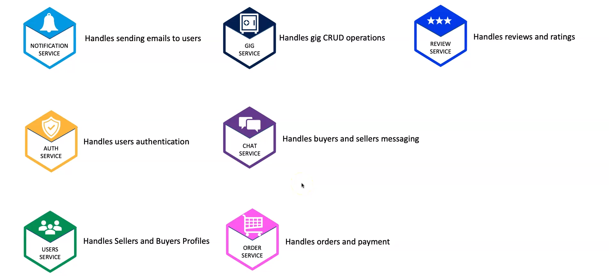

# Marketplace Service Platform

## Overview

This project is a **Marketplace for Selling Services** built using a microservices architecture. The platform allows users to list, buy, and communicate regarding services in real-time. The system is highly scalable, resilient, and optimized for modern cloud infrastructure.

## Features

- **Microservices Architecture**: Ensures scalability and maintainability.
- **Event-Driven Communication**: Services communicate asynchronously via RabbitMQ.
- **Real-Time Chat & Notifications**: Powered by Socket.IO.
- **API Gateway**: Handles requests and routes them to the appropriate services.
- **CI/CD Pipeline**: Automated builds and deployments using Jenkins.
- **Cloud Deployment**: Managed on AWS EKS with Terraform, Helm, and eksctl.
- **Database Management**: Uses RDS for relational data, MongoDB Cloud for NoSQL, and Elasticsearch Cloud for logging.
- **DNS & Load Balancing**: Managed using Ingress, Route 53, and External DNS on Namecheap.

## services

## Design Decisions

- **No Direct Client-to-Microservice Communication**: All requests from clients must go through the API Gateway.
- **Communication**:
  - Between API Gateway and other microservices: HTTP-based and Socket.IO.
  - Between microservices: Event-driven communication only (no HTTP request/response).
- **Token Management**: Token generation and management will be handled by the API Gateway.
- **Service Accessibility**: All microservices, except the API Gateway, will not be accessible from outside the system.
- **Token Inclusion**: Every request from the API Gateway will include a token.
- **Error Handling**:
  - Client errors will be sent to the API Gateway.
  - Other errors will be sent to the monitoring and logging system.

## Non-functional Requirements

- **Scalability**: The system should be able to scale to accommodate increased load during peak times.
- **Availability**: The system should be available 99.99% of the time. A failover mechanism should ensure high availability in case of server failures.
- **Reliability**: The system should be dependable.
- **Maintainability**: Code should follow coding standards and be well-documented. Regular code reviews and automated testing should be performed.
- **Usability**: Users should find the system easy to use.

## Inter-Process communication

## Project Architecture Diagram

