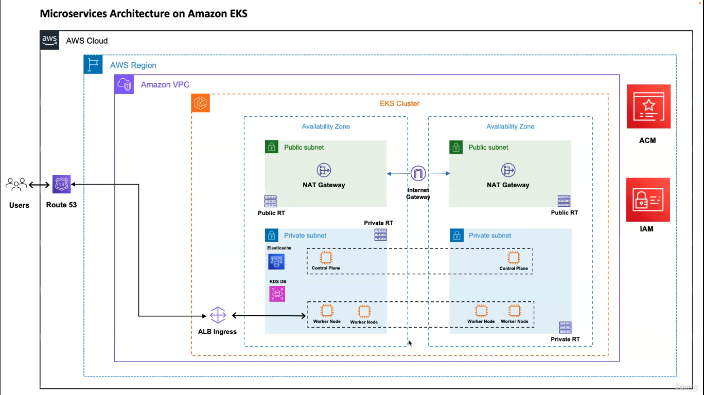

# Marketplace Service Platform

## Overview

This project is a **Marketplace for Selling Services** built using a microservices architecture. The platform allows users to list, buy, and communicate regarding services in real-time. The system is highly scalable, resilient, and optimized for modern cloud infrastructure.

## Features

- **Microservices Architecture**: Ensures scalability and maintainability.
- **Event-Driven Communication**: Services communicate asynchronously via RabbitMQ.
- **Real-Time Chat & Notifications**: Powered by Socket.IO.
- **API Gateway**: Handles requests and routes them to the appropriate services.
- **CI/CD Pipeline**: Automated builds and deployments using Jenkins.
- **Cloud Deployment**: Managed on AWS EKS with Terraform, Helm, and eksctl.
- **Database Management**: Uses RDS for relational data, MongoDB Cloud for NoSQL, and Elastic Cloud for logging.
- **DNS & Load Balancing**: Managed using Ingress, Route 53, and External DNS on Namecheap.

## Services
- **API Gateway**: Handles requests from external clients and routes them to the appropriate services. Also manages authentication, rate limiting, and traffic management.
- **Notification Emails**: Sends email notifications to users regarding various events like new messages, orders, and updates.
- **Auth Service**: Manages user authentication and authorization, including token generation and validation.
- **User Service**: Handles user-related data and functionalities, including user profiles and account settings.
- **Gigs Service**: Manages service listings, including creation, updating, and searching of services offered by users.
- **Chat Service**: Provides real-time messaging between users with integrated notifications.
- **Order Service**: Manages orders, payment processing, and transaction history between users.
- **Review Service**: Allows users to leave reviews and ratings on services, contributing to overall service reputation.

## Design Decisions

- **No Direct Client-to-Microservice Communication**: All requests from clients must go through the API Gateway.
- **Communication**:
  - Between API Gateway and other microservices: HTTP-based and Socket.IO.
  - Between microservices: Event-driven communication only (no HTTP request/response).
- **Token Management**: Token generation and management are handled by the API Gateway.
- **Service Accessibility**: All microservices, except the API Gateway, are not accessible from outside the system.
- **Token Inclusion**: Every request from the API Gateway includes a token for security and identification.
- **Error Handling**:
  - Client errors are routed back to the API Gateway.
  - Other errors are logged and monitored using the Elastic Cloud logging system.

## Production Environment

### Infrastructure Provisioning
- **Terraform**: Responsible for creating and managing the following infrastructure components:
  - **VPC**: Configured with 2 public subnets (for the bastion host and NAT gateway) and 2 private subnets (for worker nodes).
  - **NAT Gateway** with an **Elastic IP**: Enables outbound internet access for worker nodes.
  - **S3** and **DynamoDB**: Utilized as the backend for Terraform state and lock management.
  - **Security Groups**: Defined to control access to resources at the networking level.
  - **Amazon ElastiCache**: Deployed for Redis caching.
  - **Amazon RDS**: Provisioned with PostgreSQL and MySQL databases.
  - **Amazon EKS Cluster**: Created to manage Kubernetes workloads.
  - **IAM Roles and Policies**: Defined for the EKS cluster and worker nodes, with necessary policies attached.
  - **EKS Worker Nodes**: Provisioned within the private subnets to run containerized applications.
  - **High Availability**: Ensured through multi-AZ deployments and redundancy across critical components.

### Kubernetes & Service Management
- **eksctl**: Utilized to create and manage the IAM service accounts required for Kubernetes operations.
- **Helm**: Deployed and managed the **AWS Load Balancer Controller** for efficient traffic routing and **Ingress** management.

### Additional Services
- **MongoDB Cloud**: Utilized as a managed NoSQL database service.
- **Elastic Cloud**: Implemented as the logging and monitoring system, providing insights into application performance and errors.
- **Monitoring and Alerts**: Includes integration with Prometheus and Grafana for real-time monitoring and alerting.

## CI/CD Pipeline

- **Jenkins**: Automates the build, testing, and deployment processes.
  - **Integration**: Jenkins integrates with Git for version control, and triggers pipelines on code commits.
  - **Testing**: Automated unit, integration, and end-to-end tests ensure code quality.
  - **Deployment**: Jenkins pipelines deploy applications to AWS EKS, with automated rollbacks on failure.

## Security Considerations

- **IAM and Role-Based Access Control (RBAC)**: Ensures that each service and user has only the permissions they need.
- **Encryption**: All sensitive data is encrypted both at rest (using AWS KMS) and in transit (using SSL/TLS).
- **Monitoring**: Continuous monitoring of the infrastructure and applications using Elastic Cloud and Prometheus.
- **Backup and Disaster Recovery**: Regular backups of databases and critical components, with tested disaster recovery procedures.

## Conclusion

This Marketplace Service Platform is designed to be scalable, resilient, and secure, leveraging modern cloud infrastructure and best practices in software development. The microservices architecture, combined with robust CI/CD pipelines and comprehensive monitoring, ensures that the platform can handle high traffic and provide a seamless user experience.
