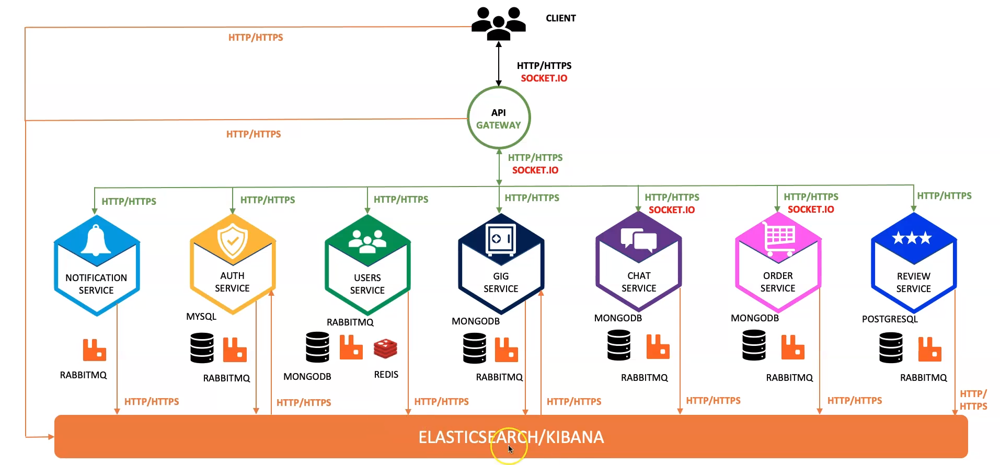
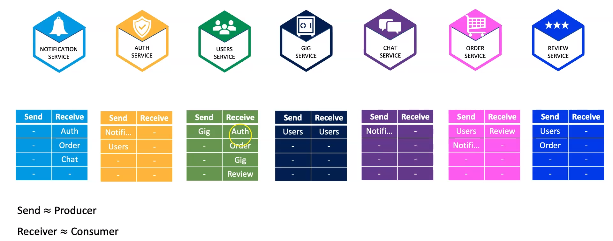

# Marketplace Service Platform

## Overview

This project is a **Marketplace for Selling Services** built using a microservices architecture. The platform allows users to list, buy, and communicate regarding services in real-time. The system is highly scalable, resilient, and optimized for modern cloud infrastructure.

## Features

- **Microservices Architecture**: Ensures scalability and maintainability.
- **Event-Driven Communication**: Services communicate asynchronously via RabbitMQ.
- **Real-Time Chat & Notifications**: Powered by Socket.IO.
- **API Gateway**: Handles requests and routes them to the appropriate services.
- **CI/CD Pipeline**: Automated builds and deployments using Jenkins.
- **Cloud Deployment**: Managed on AWS EKS with Terraform, Helm, and eksctl.
- **Database Management**: Uses RDS for relational data, MongoDB Cloud for NoSQL, and Elasticsearch Cloud for logging.
- **DNS & Load Balancing**: Managed using Ingress, Route 53, and External DNS on Namecheap.

## services
 - **API Gateway**: Handles requests from external clients and routes them to the appropriate services.
 - **Notification Emails**: Sends email notifications to users.
 - **Auth Service**: Manages user authentication and authorization.
 - **User Service**: Handles user-related data and functionalities.
 - **Gigs Service**: Manages service listings and related operations.
 - **Chat Service**: Provides real-time messaging between users.
 - **Order Service**: Manages orders and transactions.
 - **Review Service**: Allows users to leave reviews on services.

## Design Decisions

- **No Direct Client-to-Microservice Communication**: All requests from clients must go through the API Gateway.
- **Communication**:
  - Between API Gateway and other microservices: HTTP-based and Socket.IO.
  - Between microservices: Event-driven communication only (no HTTP request/response).
- **Token Management**: Token generation and management will be handled by the API Gateway.
- **Service Accessibility**: All microservices, except the API Gateway, will not be accessible from outside the system.
- **Token Inclusion**: Every request from the API Gateway will include a token.
- **Error Handling**:
  - Client errors will be sent to the API Gateway.
  - Other errors will be sent to the monitoring and logging system.

## Inter-Process communication

